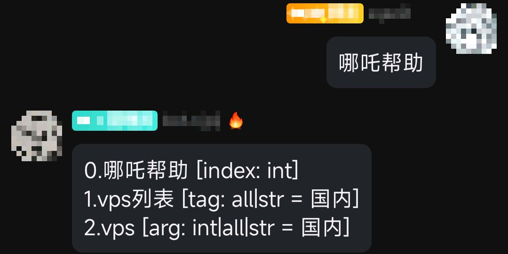
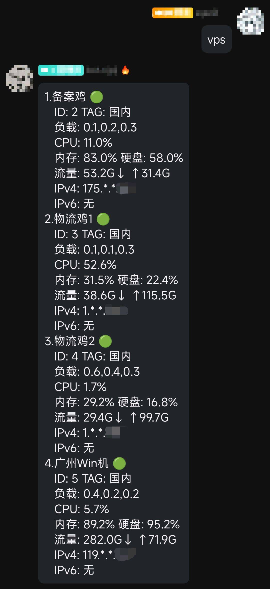
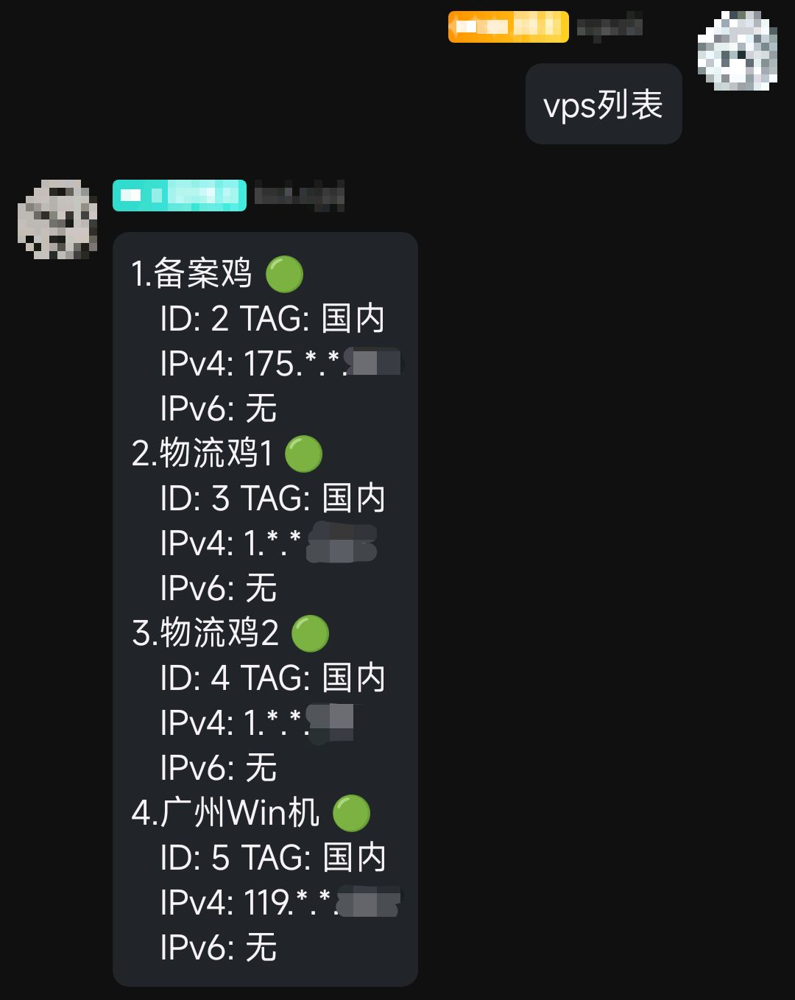

<p align="center">
  <a href="https://nonebot.dev/"></a>
</p>

<div align="center">

# NoneBot Plugin NeZha
## 哪吒监控插件


</div>

## 安装方式

### 依赖管理

- `pip install nonebot-plugin-nezha`
- `poetry add nonebot-plugin-nezha`
- `pdm add nonebot-plugin-nezha`

> 在 `bot.py` 中添加 `nonebot.load_plugin("nonebot_plugin_nezha")`

### nb-cli

- `nb plugin install nonebot-plugin-nezha`

## 使用方式

- 哪吒帮助 [index: int]
- vps列表 [tag: str]
- vps [arg: int|str]

## 配置项

### 必要配置项

- `nezha_api`: 哪吒监控 api地址
- `nezha_token`: 哪吒监控 token

### 非必要配置项

详见 [config.py](./nonebot_plugin_nezha/config.py) [Config](./nonebot_plugin_nezha/config.py#L10-L59)

### 推荐配置项

```dotenv
nezha_api=""
nezha_token=""
# 默认的分组
nezha_arg_default="国内"
# 在线/离线 的文本
nezha_template_online_offline=["🟢","🔴"]
```

## 依赖项

- [nonebot2](https://github.com/nonebot/nonebot2)
    - `>=2.1.0`
- [plugin-alconna](https://github.com/nonebot/plugin-alconna)
    - `>=0.35.0,<=0.40.0`

## 相关

- 哪吒监控官网 https://nezha.wiki
- 哪吒监控项目地址 https://github.com/naiba/nezha

## 效果

- 哪吒帮助
  
- vps
  
- vps列表
  